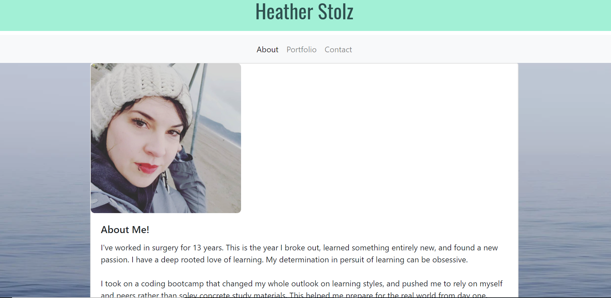

# Ractive-Portfolio
Reactive Portfolio-wk2

## Professional Page
This page, completed for week 2 contains true information about me and projects I've accomplished in my time enrolled in coding bootcamp.

Components used are my own style sheet, as well as GoogleFonts, and Bootstrap

I used many components of Bootstrap including their navagation bar, cards, and carousel features. 

Youtube and Google helped me develop the contact form. As well as many styling components.

## Goals
The goals with this project were to use semantic html, responsive content, links that worked correctly, consistant nav bar, personal information, and proper use of Bootstrap and it's components.

## Future Plan
Fix contact page links. 

Adjust footer styling.

Adjust portfolio page card styling.

## Link
https://wanderingtech.github.io/Reactive-Portfolio/

